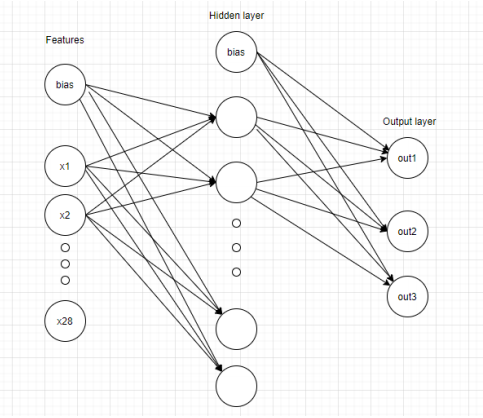

Implemantation of a neural network in machine learning using python.

The labels are three based on the goals of each team (home team , away team).

If home team goals - away team goals > 0 then label is H (home win)

If home team goals - away team goals = 0 then label is D (draw)

If home team goals - away team goals < 0 then label is A (away win)

There are four betting companies {B365,BW,IW,LB} and the vector Ψκ have the betting odds for each company and each match possible outcome.

Implement a multilayer neural network so that the
trained classifier to implement a function of its distinction
form 𝒈 (𝜱 (𝒎)): ℝ𝟐𝟖 → {𝑯, 𝑫, 𝑨}, where 𝜱 (𝒎) ∈ ℝ𝟐𝟖 corresponds to
full vector characteristics of each race given by
relationship:

𝜱(𝒎) = [𝝋(𝒉),𝝋(𝜶),𝝍𝑩𝟑𝟔𝟓(𝒎),𝝍𝑩𝑾(𝒎),𝝍𝑰𝑾(𝒎), 𝝍𝑳𝑾(𝒎)]

Database used: https://www.kaggle.com/hugomathien/soccer

